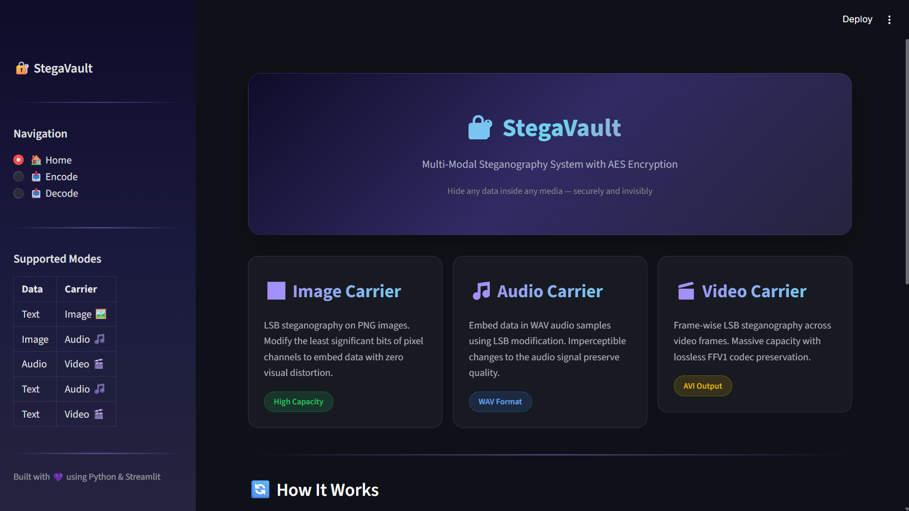
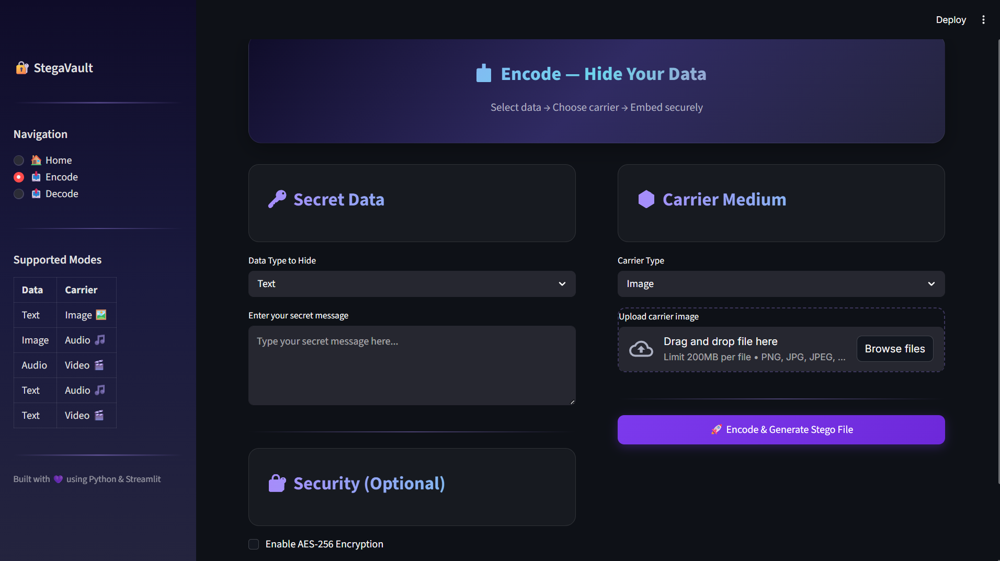
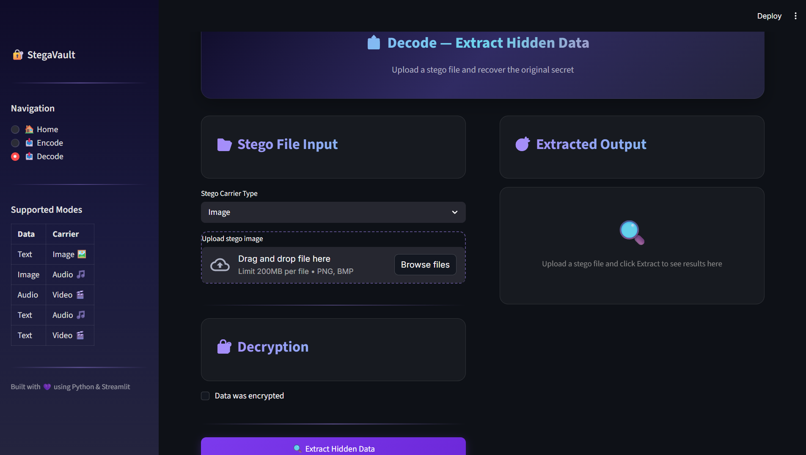

<div align="center">

# 🔐 StegaVault
### *Multi-Modal Steganography & Cryptography Suite*

[](https://www.python.org/)
[](https://streamlit.io/)
[](#)
[](LICENSE)

**StegaVault** is a premium, high-security, multi-modal steganography application designed to hide sensitive payload data (Text, Images, or Audio) inside various carrier files (Images, Audio, or Video) with built-in AES-256 encryption.

[Key Features](#-key-features) • [Preview](#-application-preview) • [Architecture](#-system-architecture) • [Protocol](#-steganography-headers--protocol) • [Setup](#-installation--setup)

</div>

---

## 📸 Application Preview

Here is a look at the custom dark-themed Streamlit user interface featuring a glassmorphic design:

### 🏠 Home Dashboard


### 📤 Encoding & Hiding Payloads


### 📥 Decoding & Extracting Payloads


---

## 🌟 Key Features

*   **⚡ Multi-Modal Capabilities**: Supports embedding arbitrary payloads (Text, Image, Audio) inside:
    *   **Images**: Lossless PNG/BMP LSB encoding.
    *   **Audio**: WAV LSB encoding with sample-width-aware packing.
    *   **Video**: Frame-by-frame LSB encoding, preserved losslessly using the `FFV1` codec inside an AVI wrapper.
*   **🔒 AES-256 Encryption (Optional)**: Payloads are secured prior to embedding. Keys are derived from user passwords using **SHA-256**, and encrypted using **AES-256-CBC** with PKCS7 padding.
*   **⚖️ Capacity Verification**: Real-time capacity computation checks carrier size against payload size before encoding, warning users if limits are exceeded.
*   **👁️ Imperceptibility Checker**: Side-by-side comparison of the original carrier and stego carrier, complete with PSNR calculation where applicable.
*   **📁 Smart Extraction**: Automatically parses headers to identify payload format and presents inline previews (rendered text, images, or audio players) and download buttons.

---

## 📐 System Architecture

StegaVault is organized into a modular structure separating UI components from the underlying steganography engine:

```
Steganography/
├── app.py                  # Streamlit entry point, layout, and page routing
├── requirements.txt        # Package dependencies
├── core/
│   ├── __init__.py
│   ├── engine.py           # Unified encoding/decoding orchestrator
│   ├── crypto.py           # AES-256 encryption/decryption utilities
│   ├── image_steg.py       # LSB image embedding and recovery
│   ├── audio_steg.py       # LSB audio sample manipulation
│   ├── video_steg.py       # LSB video frame manipulation via OpenCV
│   └── utils.py            # Binary parsing and header preparation helpers
└── ui/
    ├── __init__.py
    └── styles.py           # Custom CSS styling (dark glassmorphism, badges, banners)
```

---

## 📥 Steganography Headers & Protocol

To allow automated extraction without prior knowledge of the data size or format, StegaVault embeds a **40-bit custom metadata header** at the start of every stego carrier:

| Component | Offset (Bits) | Size | Description |
| :--- | :--- | :--- | :--- |
| **Data Type** | `0 - 7` | 8 bits | Identifies payload type: `0x01` = Text, `0x02` = Image, `0x03` = Audio. |
| **Payload Length** | `8 - 39` | 32 bits | Unsigned integer specifying the payload size in bytes. |
| **Encrypted Payload** | `40+` | Variable | The actual payload bytes (potentially AES-256 encrypted). |

---

## 🛠️ Carrier Modules & Tech Stack

<details>
<summary><b>🔍 Expand to view Carrier Modules Details</b></summary>

### 1. Image Carrier (`core/image_steg.py`)
- Standard LSB (Least Significant Bit) replacement on RGB channels of flat pixel arrays.
- High capacity carrier.
- Uses `PIL` and `NumPy` for efficient flattening and reshaping of image channels.

### 2. Audio Carrier (`core/audio_steg.py`)
- LSB replacement within raw audio samples.
- Supports both **8-bit unsigned** and **16-bit signed** WAV formats.
- Correctly handles negative values in 16-bit audio to prevent distortion or noise issues during playback.

### 3. Video Carrier (`core/video_steg.py`)
- Performs frame-by-frame steganography across pixel channels.
- Employs the **FFV1** video codec, a lossless intra-frame compression standard, ensuring that normal video compression doesn't destroy the payload bits.
- Powered by OpenCV (`cv2`) for frame retrieval, packing, and reassembly.

### 4. Cryptography (`core/crypto.py`)
- Derives a 256-bit key from user input via **SHA-256**.
- Uses a cryptographically secure random **16-byte Initialization Vector (IV)** for AES CBC mode.
- Output byte layout: `IV (16 bytes)` followed by the `Ciphertext`.

</details>

---

## 🚀 Installation & Setup

Ensure you have **Python 3.8+** installed.

### 1. Clone the Repository
```bash
git clone https://github.com/A-RYAN-KR/Steganography.git
cd Steganography
```

### 2. Set Up a Virtual Environment (Recommended)
```bash
python -m venv venv
```
Activate it:
- **Windows**: `venv\Scripts\activate`
- **macOS/Linux**: `source venv/bin/activate`

### 3. Install Dependencies
```bash
pip install -r requirements.txt
```

### 4. Run the Streamlit Application
```bash
streamlit run app.py
```
Open [http://localhost:8501](http://localhost:8501) in your browser to start hiding your secrets.

---

## 📦 Core Dependencies

The application relies on the following packages:
*   [Streamlit](https://streamlit.io/) — Frontend interactive dashboard framework.
*   [NumPy](https://numpy.org/) — Array manipulations for images and video frames.
*   [OpenCV](https://opencv.org/) — Lossless frame extraction and compilation.
*   [Pillow](https://python-pillow.org/) — Image loading, conversion, and metadata processing.
*   [Pydub](https://github.com/jiaaro/pydub) — Audio file loading and format conversions.
*   [PyCryptodome](https://www.pycryptodome.org/) — AES-256-CBC implementation.

---

## 🔒 Security Notice

> [!WARNING]  
> StegaVault is designed to hide information visually and acoustically (steganography) alongside strong cryptographic protection. Please note that LSB-based steganography is vulnerable to carrier transformation (resizing, lossy compression, file conversion). Always share the stego carrier in its original format (e.g., `.png` for images, `.wav` for audio, and `.avi` with `FFV1` for video) to avoid destroying the embedded payload.

---

## 📝 License

This project is licensed under the MIT License.
